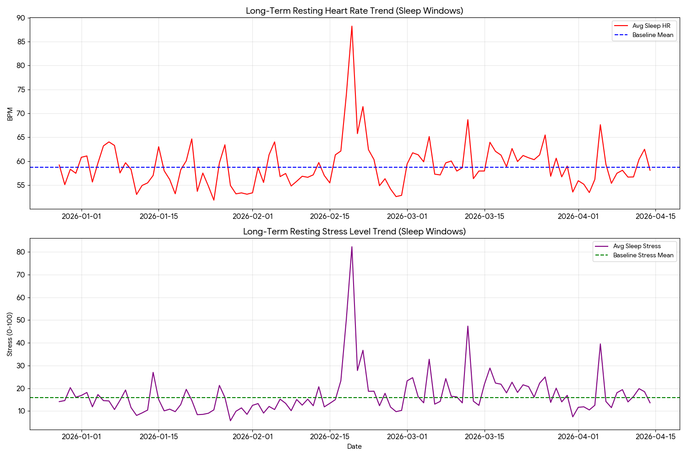
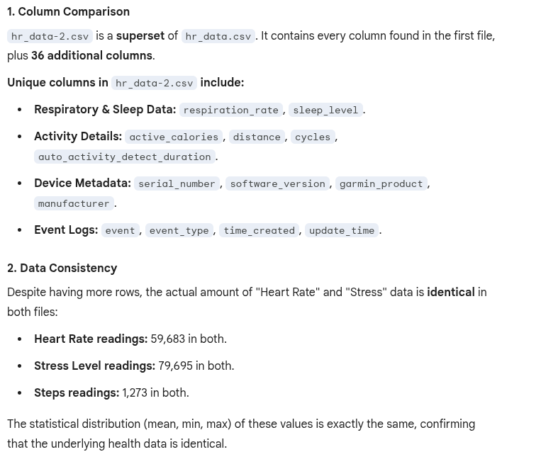

# gemini-hr-aggregation
This code extracts heart rate data from Garmin export files.  It aggregates the HR data in a form that Google Gemini can analyze.  This is a quick and dirty project with hard coded paths.  To use it, download zip files from the Garmin web app (Profile -> Account Settings -> Account Information -> bottom of page).  Extract as many days data as you would like and place the zip files in a directory called /data/fit.  I tested this on both Windows and Linux, thus the lack of a drive letter.  Make sure you install the modules in the requirements file (python -m pip install -r requirements.txt in the repo directory).  Run the code (garminfitextract.py), it will extract the files from the zip files into the directory and extract the heart rate data into DataFrames which it will concatenate and export into a file called hr_data.csv.  Upload this file to [Gemini](https://gemini.google.com/app) with any information you would like to give context.  For example, "analyze the file noting that I was sick on 2/18, I ran 5K on 2/28, played soccer on 3/1, ran a mile on 3/2, bicycled 5 miles on 3/3 and played soccer last night (I ran 2 miles in the game). I am refereeing 3 games on Saturday.Please comment on my recovery."  In my case Gemini characterized my infection and recovery and told me to rest because my base heart rate had not returned to normal. I am using a Garmin Forerunner 55 (the low end model).  Higher models also produce ACTIVITY files.  I don't have any samples, so the code ignores these files.

The chart below is based on 4 months of garmin data with the infection right in the middle.  The spikes to the right correspond to the beginning of soccer season and tournament weekends where I oficiated several games a day each weekend.

|  |
| :--- |
 
One of the things that has frustrated me about fitparse is all the unknown data.  There's information in the files but fitparse does not know what it represents.  In fairness to David, the author, ([fitparse on github])(https://github.com/dtcooper/python-fitparse), he does say that he doesn't have time to update the code and he does provide instructions on how to update the SDK version.  I have not done that.  David mentioned the [fitdecode module](https://github.com/polyvertex/fitdecode) as an alternative that is more up to date.  It's also a stream parser and theoretially faster.
Out of curiosity, I rewrote the export code to use fitdecode.  My primary concern after the first version worked was whether the output was the same for both parsers.  I oploaded the two files to Gemini and asked for a comparison.  Thankfully, I got the response that the second file is a superset of the first.
<kbd>

</kbd>
 
For one run from December through April, fitparse finished in 1:50 while fitdecode finished in 1:40.  There was a slight performance improvement.  Keep in mind that I haven't doen any optimizations to either version.  In the future I may cache the parsing results in pickled form by file and simply concatenate.  I expect the speed to improve but 2 minutes for several months of data does not annoy me.
I ran the full enhanced file through Gemini and found that Gemini silently fails.  It appears that there's a file size limit.  A 20M csv worked but with a 53M file with 696,564 rows, Gemini just deleted the prompt and returned.  Given that many of the data elements are spurious, I'll probalby start reducing the interesting columns in that program.
As part of this effort, I've renamed the original script with -parse and the new one as -decode.
